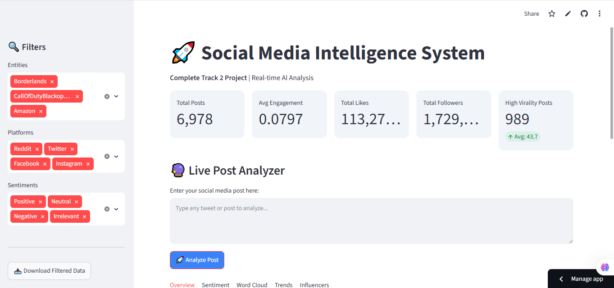
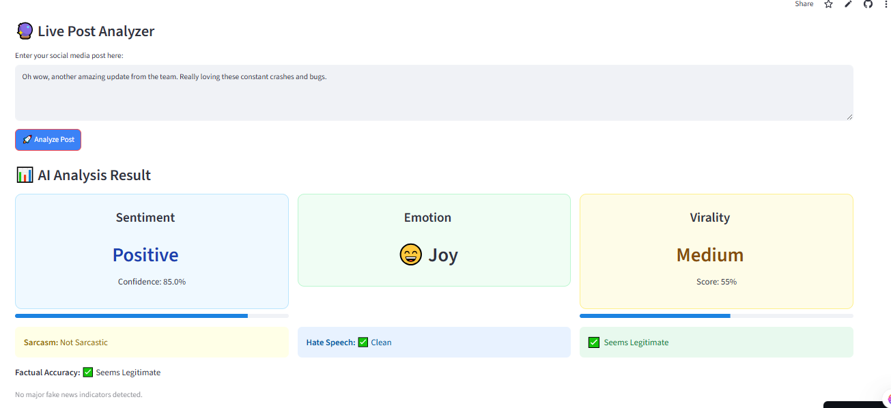
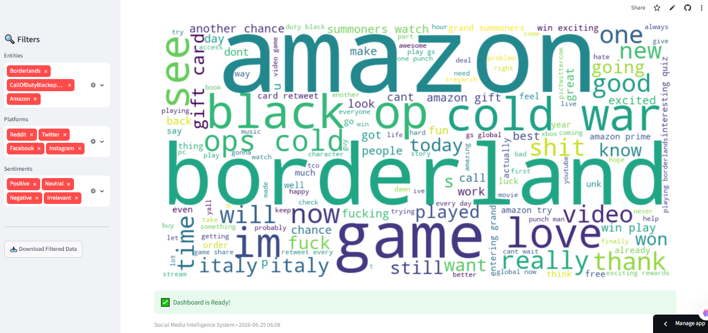

align="center">

# 🚀 Social Media Intelligence System

**Analyze • Understand • Predict Social Media Content in Real-Time**

[](#)
[](#)
[](#)
[](#)

*Turning social media noise into actionable intelligence using Natural Language Processing and Machine Learning.*

<br>




Live : https://social-media-intelligence-system-rhwgfpegcjrg7lyueyfcjf.streamlit.app/

</div>

---

## 📋 Project Overview

This project is a complete **Social Media Intelligence System** designed to analyze Twitter-style posts and extract valuable, real-time insights. From sentiment and emotion detection to sarcasm, fake news identification, and virality prediction, this system decodes digital conversations.

Featuring a clean, interactive **Streamlit Dashboard**, it is the perfect tool for brands, researchers, marketers, and data science enthusiasts who want to perform live post analysis with zero friction.

---

## ✨ Key Features

*   **⚡ Live Post Analyzer** — Paste any text/tweet and receive instant AI-driven analysis.
*   **🎭 Sentiment Analysis** — Classifies content as *Positive, Negative,* or *Neutral*.
*   **🧠 Emotion Detection** — Identifies underlying emotions like *Joy, Anger, Sadness,* or *Neutrality*.
*   **🛡️ Fake News & Factual Accuracy** — Flags potential misinformation.
*   **🤡 Sarcasm & Hate Speech Detection** — Understands context beyond literal meanings.
*   **📈 Virality Prediction** — Estimates the spread and engagement potential of a post.
*   **📊 Interactive Dashboard** — Dynamic filters, live trends, influencer tracking, and word clouds.
*   **📉 Data Visualization** — Beautiful charts, metrics, and graphs for deep-dive analytics.

---

## 🛠️ Technologies Used

| Category | Technologies |
| :--- | :--- |
| **Core Language** | Python 3.12 |
| **Web Dashboard** | Streamlit |
| **Data Handling** | Pandas, NumPy |
| **Machine Learning** | Scikit-learn, TF-IDF |
| **NLP Processing** | NLTK, TextBlob |
| **Visualizations** | Plotly, Matplotlib, WordCloud |

---

## 📁 Project Structure

```text
social-media-intelligence-system/
├── app.py                                              # Main Streamlit Dashboard application
├── social media intelligence system.ipynb              # Complete Data Science & ML Notebook
├── requirements.txt                                    # Python Dependencies
├── dataset/                    
    └── twitter_training_enhanced.csv
    └── cleaned_twitter_data.csv
├── social media intelligence system.ipynb              # Project documentation
└── README.md                                     
🚀 How to Run Locally
Follow these simple steps to get the project up and running on your local machine:

1. Clone the Repository
Bash
git clone <your-repo-url>
cd social-media-intelligence-system
2. Install Dependencies
Make sure you have Python 3.12 installed, then run:

Bash
pip install -r requirements.txt
3. Run the Application
Launch the Streamlit server:

Bash
streamlit run app.py
🔍 Features in Detail
KPI Dashboard: Get an at-a-glance view of Total Posts, Overall Engagement, Likes, Followers, and High Virality content.

Live Analyzer: Real-time text analysis with a detailed breakdown of NLP metrics.

Visualizations: Interactive Sentiment Pie Charts, Dynamic Word Clouds, and Virality Histograms.

Granular Filters: Slice and dice your data by Brand, Platform, and Sentiment.

🎯 Use Cases
🏢 Brand Monitoring & Reputation Management: Track how the public perceives your brand.

🛑 Misinformation Detection: Identify and flag fake news before it spreads.

📈 Trend Analysis: Catch early signals of what is going viral on social media.

🚀 Campaign Tracking: Measure the performance and sentiment of marketing campaigns.

🎓 Academic Research: Study public opinion, linguistic patterns, and digital sociology.

🔮 Future Enhancements (Roadmap)
[ ] Integrate Advanced LLMs (BERT / RoBERTa) for deeper contextual understanding.

[ ] Add real-time Twitter API streaming integration.

[ ] Implement multi-language support for global analysis.

[ ] Add user authentication and personalized dashboards.

[ ] Deploy to Cloud platforms (AWS / Streamlit Cloud).

📄 Documentation
Detailed project documentation, including model architecture and data processing pipelines, is available within the repository (see pipeline.ipynb).

👨‍💻 Author
Akash Kumar Ojha

Data Science | AI Enthusiast | Python Developer

⭐ Show Your Support

If you found this project helpful or interesting, please consider giving it a ⭐ on GitHub!

Made with ❤️ using Python & Streamlit
